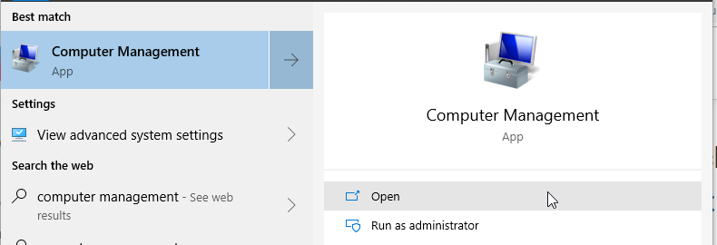
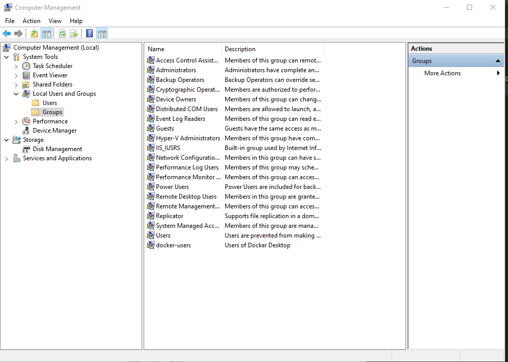
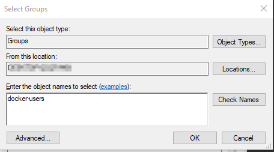

# Troubleshooting

## The WMI service returned an 'access denied' error

When running a script, you may see the following error:

```text
VERBOSE: Perform operation 'Invoke CimMethod' with following parameters, ''methodName' =
SendConfigurationApply,'className' = MSFT_DSCLocalConfigurationManager,'namespaceName' =
root/Microsoft/Windows/DesiredStateConfiguration'.
The WS-Management service cannot process the request. The WMI service returned an 'access denied' error.
    + CategoryInfo          : PermissionDenied: (root/Microsoft/...gurationManager:String) [], CimException
    + FullyQualifiedErrorId : HRESULT 0x80338104
    + PSComputerName        : localhost
```

**Solution:**

Make sure you start your PowerShell session with **Run as administrator** option.

## The request size exceeded the configured MaxEnvelopeSize quota

When running a script, you may run into the following issue:

```text
VERBOSE: Perform operation 'Invoke CimMethod' with following parameters, ''methodName' =
SendConfigurationApply,'className' = MSFT_DSCLocalConfigurationManager,'namespaceName' =
root/Microsoft/Windows/DesiredStateConfiguration'.
The WinRM client sent a request to the remote WS-Management service and was notified that the request size exceeded
the configured MaxEnvelopeSize quota.
    + CategoryInfo          : LimitsExceeded: (root/Microsoft/...gurationManager:String) [], CimException
    + FullyQualifiedErrorId : HRESULT 0x80338111
    + PSComputerName        : localhost
```

**Solution:**

The [solution for this issue][1] is to increase the maximum envelope size, by 
running the following command in an elevated PowerShell session:

```PowerShell
Set-Item -Path WSMan:\localhost\MaxEnvelopeSizeKb -Value 2048
```

[1]: https://github.com/powershell/sharepointdsc/wiki/Error-Exceeded-the-configured-MaxEnvelopeSize-quota

## Script execution fails

Loading a script fails:

```text
.\SetupMachine.ps1 : File C:\Users\babydragon\Documents\windows-machine\SetupMachine.ps1 cannot be loaded because
running scripts is disabled on this system. For more information, see about_Execution_Policies at
https:/go.microsoft.com/fwlink/?LinkID=135170.
At line:1 char:1
+ .\SetupMachine.ps1
+ ~~~~~~~~~~~~~~~~~~
    + CategoryInfo          : SecurityError: (:) [], PSSecurityException
    + FullyQualifiedErrorId : UnauthorizedAccess
```

Change machine level PowerShell [ExecutionPolicy][2] to `RemoteSigned` in the 
`LocalMachine` scope:

```PowerShell
Set-ExecutionPolicy -ExecutionPolicy RemoteSigned -Scope LocalMachine
```

## Execution Policy error when running DSC modules

cChoco modules fail to run:

```text
Importing module cChocoPackageInstall failed with error - File C:\Program
Files\WindowsPowerShell\Modules\cChoco\2.4.0.0\DscResources\cChocoPackageInstall\cChocoPackageInstall.psm1 cannot be loaded. The file C:\Program
Files\WindowsPowerShell\Modules\cChoco\2.4.0.0\DscResources\cChocoPackageInstall\cChocoPackageInstall.psm1 is not digitally signed.
```

**Solution:**

Change machine level PowerShell [ExecutionPolicy][2] to` RemoteSigned` in the 
`LocalMachine` scope:

```PowerShell
Set-ExecutionPolicy -ExecutionPolicy RemoteSigned -Scope LocalMachine
```

[2]: https://docs.microsoft.com/en-gb/powershell/module/microsoft.powershell.core/about/about_execution_policies?view=powershell-5.1

## Client cannot connect to the destination

You're seeing the following error when trying to run configuration scripts:

```text
The client cannot connect to the destination specified in the request. Verify
that the service on the destination is running and is accepting requests.
Consult the logs and documentation for the WS-Management service running on 
the destination, most commonly IIS or WinRM.
```

**Solution:**

Configure WinRM.

## Hyper-V network detected as public prevents WinRM installation

You're seeing the following error when enabling WinRM and you have Hyper-V enabled:

```text
WinRM firewall exception will not work since one of the network connection 
types on this machine is set to Public. Change the network connection type 
to either Domain or Private and try again.
```

**Solution:**

Run following command to find the `InterfaceIndex` value:

```PowerShell
Get-NetConnectionProfile
```

Hyper-V network will show up as `Unidentified network`:

```text
Name             : Unidentified network
InterfaceAlias   : vEthernet (Default Switch)
InterfaceIndex   : 17
NetworkCategory  : Public
IPv4Connectivity : NoTraffic
IPv6Connectivity : NoTraffic
```

Change network category to Private using the correct `InterfaceIndex` value:

```PowerShell
Set-NetConnectionProfile -InterfaceIndex 17 -NetworkCategory Private
```

## Access denied when starting Docker Desktop

You're seeing the following error when starting **Docker Desktop** application.


Open **Computer Management** application.



Open **Local users and groups** > **Groups** and double-click
**docker-users** group to edit it.



You'll see the current users in the group.


If you are not in the group, go to **Users** on the left face and select your user account.


Click **Add...** and add **docker-users** group into your groups.



Click **OK** twice and close the application.

**Log out of Windows** and your **docker-users** membership will be taken into account.